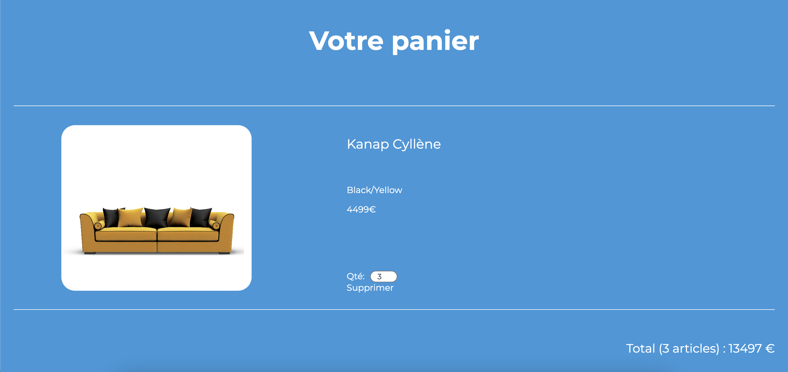

# Kanap
# 🛒 Building an online shop with Javascript

This is my solution to the 5th project of the Web developer OpenClassrooms course. In this challenge, you already have the HTML and CSS code. You need to create all the dynamical data with JS and a local API.

## Overview

### The challenge

Your challenge :

- Display the data using the local API
- Running test using the template they provide

### Screenshot

### Links

- Solution URL: (https://carolinelienard.github.io/Kanap/)

### Built with

- HTML5
- CSS
- Javascript

## Author

- Caroline Lienard (https://github.com/CarolineLienard)
- Frontend Mentor - (https://www.frontendmentor.io/challenges/expenses-chart-component-e7yJBUdjwt/hub/expenses-chart-component-Yb6C7NgV1a)

#### Note: If you are student, do your best to create your own solution, you got this 👍🏻
